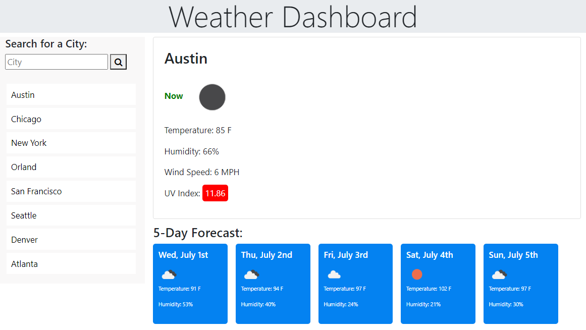

# 06 Server-Side APIs: Weather Dashboard

Weather application that allows the user to retrieve the current weather for any city as well as a five day forecast.  

```
Enter a city in the search box or pick one from the menu. In the right pane, the user can view the current temperature, humidity, wind speed, and UV Index.  The index background will change colors depending the on the level of UV radiation.  The colors are in line with the EPA's UV Index Scale. A five day forecast is also displayed showing the current temperature, humidity, and a picture representing the current conditions for each day.

Upon opening of the app, the current conditions and a five day forecast will be displayed for the last city that was retrieved on the user's local machine. 
```
App URL: https://waltrevino.github.io/HW6/
Github repo: https://github.com/Waltrevino/HW6


